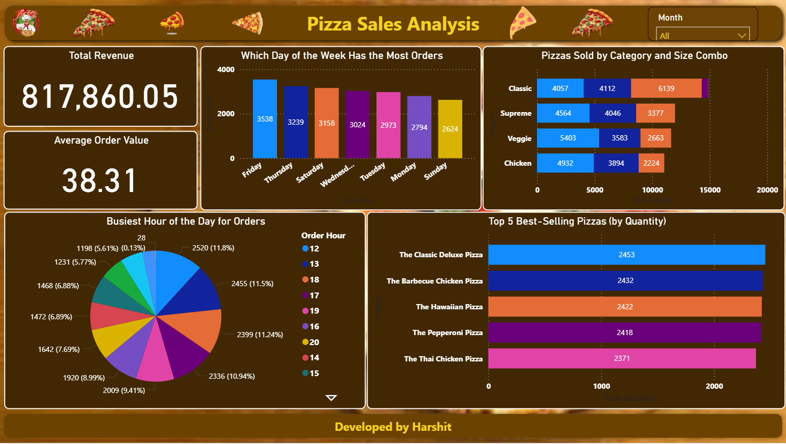
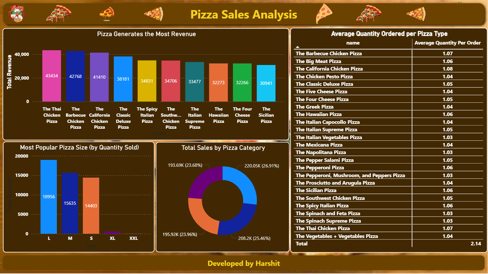
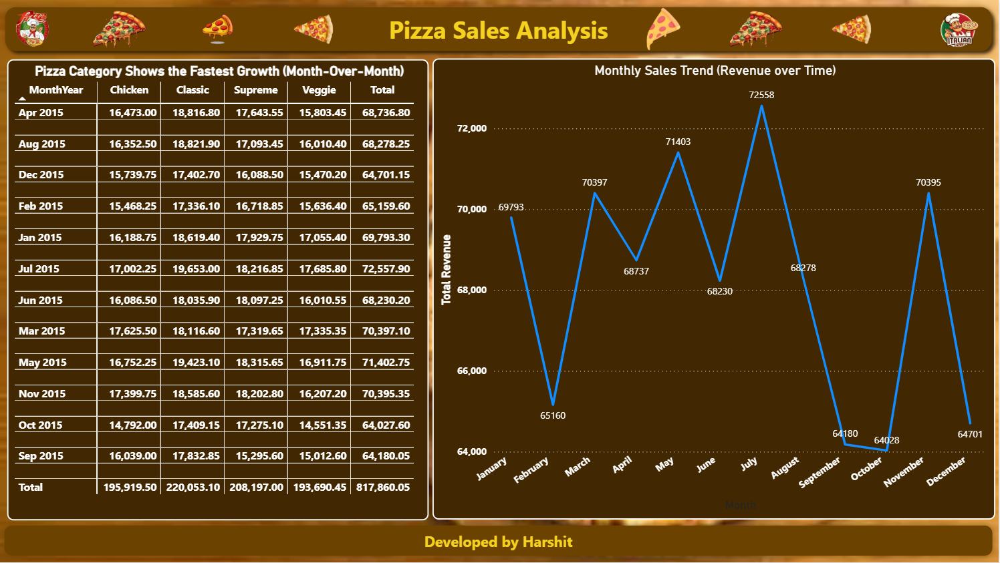

  <a href="https://your-live-dashboard-link.com">
      
      
      
  </a>

# 🍕 Power BI Pizza Sales Dashboard

An interactive Power BI dashboard project built to analyze pizza sales using a real-world dataset. This project covers business KPIs, trend analysis, product performance, and customer behavior.

## 📂 Dataset

This project uses 4 CSV files:

- `orders.csv` – Order IDs, dates, times  
- `order_details.csv` – Pizza quantities per order  
- `pizzas.csv` – Price and size info per pizza  
- `pizza_types.csv` – Pizza names, categories, ingredients

---

## 📊 Dashboard Features

✅ Key Metrics:
- Total Revenue
- Total Orders
- Average Order Value
- Estimated Profit

✅ Visual Insights:
- Top 5 Selling Pizzas
- Revenue by Pizza Category
- Sales by Size
- Monthly Revenue Trend
- Most Common Pizza Combos
- Orders by Day & Hour

✅ Advanced Analysis:
- Estimated Preparation Time
- Month-over-Month Growth by Category
- Pizza Category Performance Matrix

---

## 📌 Key Learnings

- Data Modeling & Relationships in Power BI
- DAX Measures (SUMX, AVERAGEX, DIVIDE, DATEADD, FORMAT)
- Time Intelligence
- Slicer Syncing across Pages
- Power Query for combo detection

---

## 📷 Dashboard Preview

[Pizza Dashboard](https://pizzasales2025.streamlit.app/)

## 💻 Tools Used

- Power BI Desktop  
- DAX (Data Analysis Expressions)  
- Power Query  
- CSV Files (Structured Dataset)

📫 Contact
Name: Harshit Chugh

[Email](10harshit2003@gmail.com)

[GitHub](https://github.com/HarshitChugh0628/Pizza-Sales)

❤️ Acknowledgements :

Thanks for your Support

